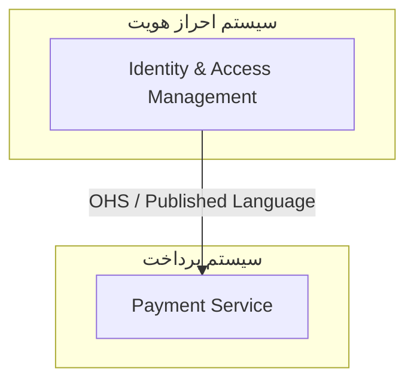

# پروپوزال سیستم هوشمند تولید مستندات معماری و رادار تکنولوژی سازمانی

**عنوان پروژه:** ArchDoc Intelligence Platform (ADIP)
**نسخه پروپوزال:** 1.0  
**تاریخ تهیه:** اسفند ۱۴۰۳  
**وضعیت:** پیشنهاد اولیه برای تصویب  
**مرجع استاندارد:** SAW_102 – Architecture Documentation Standards v1.0  

---

## فهرست مطالب

1. [خلاصه اجرایی](#۱-خلاصه-اجرایی)
2. [تعریف مسئله](#۲-تعریف-مسئله)
3. [اهداف و دامنه پروژه](#۳-اهداف-و-دامنه-پروژه)
4. [معماری کلی سیستم](#۴-معماری-کلی-سیستم)
5. [مشخصات قابلیت‌های سیستم](#۵-مشخصات-قابلیت‌های-سیستم)
6. [معماری Agent‌های هوش مصنوعی و MCP](#۶-معماری-agentهای-هوش-مصنوعی-و-mcp)
7. [استک تکنولوژی](#۷-استک-تکنولوژی)
8. [ساختار تیم و منابع انسانی](#۸-ساختار-تیم-و-منابع-انسانی)
9. [برنامه پیاده‌سازی سه‌ماهه](#۹-برنامه-پیاده‌سازی-سه‌ماهه)
10. [منابع مورد نیاز - سناریو اول: سرویس‌های تجاری](#۱۰-منابع-مورد-نیاز---سناریو-اول-سرویس‌های-تجاری)
11. [منابع مورد نیاز - سناریو دوم: مدل‌های متن‌باز درون‌سازمانی](#۱۱-منابع-مورد-نیاز---سناریو-دوم-مدل‌های-متن‌باز-درون‌سازمانی)
12. [تحلیل ریسک](#۱۲-تحلیل-ریسک)
13. [پیشنهادات تکمیلی و قابلیت‌های توسعه‌پذیر](#۱۳-پیشنهادات-تکمیلی-و-قابلیت‌های-توسعه‌پذیر)
14. [ضمائم](#۱۴-ضمائم)

---

## ۱. خلاصه اجرایی

پروژه **ArchDoc Intelligence Platform (ADIP)** یک سیستم هوشمند مبتنی بر عوامل هوش مصنوعی (AI Agents) و پروتکل Model Context Protocol (MCP) است که به‌منظور خودکارسازی فرآیند تولید، بهروزرسانی و نگهداری مستندات معماری نرم‌افزار طراحی شده است. این سیستم با اتکا به استاندارد داخلی SAW_102 و انتگراسیون با مخازن کد سازمانی (Bitbucket / GitLab)، فرآیند مستندسازی را از فعالیتی دستی و پراکنده به یک چرخه خودکار، استاندارد و قابل‌پیگیری تبدیل می‌کند.

افزون بر قابلیت مستندسازی، ADIP دارای یک ماژول تحلیل تکنولوژی است که بر اساس داده استخراج‌شده از تمام مخازن، رادار تکنولوژی سازمانی را به‌صورت خودکار تولید نموده و آن را با آخرین رادارهای ThoughtWorks Technology Radar و Gartner Hype Cycle مقایسه کرده و گزارش تحلیلی جامعی از شکاف‌ها و فرصت‌های بهبود ارائه می‌دهد.

**مزایای کلیدی:**
- کاهش ۸۵٪ زمان صرف‌شده برای مستندسازی دستی
- یکپارچگی و رعایت ۱۰۰٪ استانداردهای سازمانی
- دید لحظه‌ای و دوره‌ای از وضعیت مستندات کل سازمان
- تحلیل هوشمند موقعیت تکنولوژیک سازمان در برابر معیارهای صنعت

---

## ۲. تعریف مسئله

مستندسازی معماری در سازمان‌های نرم‌افزاری با چالش‌های ساختاری مواجه است:

**۲.۱ چالش‌های موجود**

| چالش | اثر |
|------|-----|
| تولید مستندات به‌صورت دستی و وابسته به دانش فرد | عدم‌یکپارچگی و نادیده گرفتن استانداردها |
| عدم‌بهروزرسانی مستمر مستندات پس از تغییرات | Drift بین کد و مستندات |
| عدم‌وجود مرجع یکپارچه برای بررسی وضعیت مستندات | ناتوانی در Governance |
| فقدان تحلیل خودکار از فناوری‌های در حال استفاده | تصمیم‌گیری ضعیف در انتخاب تکنولوژی |
| هزینه بالای Onboarding به دلیل مستندات ناقص | کاهش سرعت توسعه |

**۲.۲ دامنه مسئله**

سیستم فعلی فاقد مکانیزم اجرایی برای رعایت استاندارد SAW_102 است. این استاندارد الزاماتی را در قالب مدل C4، ADR، Context Mapping، OpenAPI، AsyncAPI و Data Catalog تعریف می‌کند که بدون ابزار خودکارسازی، نگهداری آن‌ها به‌صورت پیوسته و استاندارد ممکن نیست.

---

## ۳. اهداف و دامنه پروژه

### ۳.۱ اهداف اصلی

1. **خودکارسازی مستندسازی:** تولید خودکار مستندات معماری مطابق SAW_102 از روی کد منبع
2. **به‌روز نگه داشتن مستندات:** اجرای دوره‌ای با تشخیص هوشمند تغییرات
3. **رادار تکنولوژی سازمانی:** تولید، نمایش و مقایسه رادار تکنولوژی
4. **Governance یکپارچه:** داشبورد مرکزی جهت پیگیری وضعیت مستندات

### ۳.۲ دامنه پروژه

| در دامنه | خارج از دامنه |
|---------|--------------|
| مخازن Bitbucket / GitLab سازمانی | مخازن عمومی GitHub |
| مستندات C4 (سطوح ۱ تا ۳) | کدنویسی خودکار |
| ADR، Context Map، OpenAPI، AsyncAPI | مستندات کاربری (User Manual) |
| Data Catalog (اطلاعات پایه) | تحلیل امنیتی کد |
| رادار تکنولوژی سازمانی | ارزیابی کیفیت کد |
| مقایسه با ThoughtWorks/Gartner | مدیریت پروژه |

---

## ۴. معماری کلی سیستم

### ۴.۱ نمای کلی معماری

```
┌─────────────────────────────────────────────────────────────────────┐
│                    ADIP - ArchDoc Intelligence Platform              │
│                                                                     │
│  ┌──────────────┐    ┌─────────────────┐    ┌──────────────────┐   │
│  │  Scheduler   │───▶│  Orchestrator   │───▶│   Agent Manager  │   │
│  │  (APScheduler│    │  (LangGraph /   │    │  (Multi-Agent    │   │
│  │  / Celery)   │    │  CrewAI)        │    │   Framework)     │   │
│  └──────────────┘    └────────┬────────┘    └────────┬─────────┘   │
│                               │                      │             │
│         ┌─────────────────────▼──────────────────────▼──────────┐  │
│         │                   MCP Server Layer                     │  │
│         │  ┌──────────┐ ┌──────────┐ ┌──────────┐ ┌──────────┐ │  │
│         │  │Bitbucket │ │ GitLab   │ │Confluence│ │  Jira    │ │  │
│         │  │   MCP    │ │   MCP    │ │   MCP    │ │   MCP    │ │  │
│         │  └──────────┘ └──────────┘ └──────────┘ └──────────┘ │  │
│         └─────────────────────────────────────────────────────┘  │
│                               │                                   │
│      ┌────────────────────────▼─────────────────────────┐        │
│      │              AI Agent Pool                        │        │
│      │  ┌──────────┐ ┌──────────┐ ┌──────────────────┐  │        │
│      │  │   C4     │ │   ADR    │ │  Context Mapping  │  │        │
│      │  │  Agent   │ │  Agent   │ │      Agent        │  │        │
│      │  └──────────┘ └──────────┘ └──────────────────┘  │        │
│      │  ┌──────────┐ ┌──────────┐ ┌──────────────────┐  │        │
│      │  │ OpenAPI  │ │AsyncAPI  │ │  Tech Radar Agent │  │        │
│      │  │  Agent   │ │  Agent   │ │                   │  │        │
│      │  └──────────┘ └──────────┘ └──────────────────┘  │        │
│      └──────────────────────────────────────────────────┘        │
│                               │                                   │
│      ┌────────────────────────▼─────────────────────────┐        │
│      │              Output & Storage Layer                │        │
│      │  ┌──────────┐ ┌──────────┐ ┌──────────────────┐  │        │
│      │  │Bitbucket │ │Confluence│ │   Dashboard DB    │  │        │
│      │  │  (docs/) │ │(Diagrams)│ │   (PostgreSQL)    │  │        │
│      │  └──────────┘ └──────────┘ └──────────────────┘  │        │
│      └──────────────────────────────────────────────────┘        │
└─────────────────────────────────────────────────────────────────────┘
```

### ۴.۲ جریان اطلاعات اصلی

```
  [Scheduler Trigger]
         │
         ▼
  [Change Detection] ──── Git Diff Analysis ──── [Hash Cache DB]
         │
         ▼ (تنها repos با تغییر)
  [Orchestrator] ── تقسیم‌بندی وظایف ──▶ [Agent Pool]
         │
         ├──▶ C4 Agent ─────────────▶ c4/README.md + Confluence Diagram
         ├──▶ ADR Agent ─────────────▶ adr/NNNN-*.md
         ├──▶ Context Map Agent ─────▶ cmap/context_map.md
         ├──▶ OpenAPI Agent ─────────▶ openapi/openapi.yaml
         ├──▶ AsyncAPI Agent ─────────▶ asyncapi/asyncapi.yaml
         └──▶ Tech Radar Agent ───────▶ Tech Radar DB + Reports
                                              │
                                              ▼
                                  [Comparison with ThoughtWorks/Gartner]
                                              │
                                              ▼
                                  [Gap Analysis Report]
```

---

## ۵. مشخصات قابلیت‌های سیستم

### ۵.۱ ماژول اتصال به مخازن کد (Repository Connector)

**توضیح:** این ماژول مسئولیت اتصال به سیستم‌های مدیریت کد سازمانی را بر عهده دارد.

**قابلیت‌ها:**
- پشتیبانی از Bitbucket Server/Cloud و GitLab Self-Hosted/Cloud
- احراز هویت از طریق OAuth2 / Personal Access Token
- دریافت لیست کامل repository‌های سازمان با فیلترینگ بر اساس project، group و tag
- استخراج diff کامیت‌ها از آخرین اجرا (incremental processing)
- خواندن ساختار پوشه، dependency‌های فایل‌های build (pom.xml, package.json, requirements.txt, go.mod)
- خواندن کانفیگ‌های infrastructure (Kubernetes manifests, Docker Compose, Helm Charts, Terraform)
- Cache کردن hash درخت فایل‌ها جهت تشخیص بهینه تغییرات

**ورودی:** اطلاعات اتصال (URL, Token)  
**خروجی:** ساختار داده‌ای یکپارچه از محتوای repository

---

### ۵.۲ ماژول زمان‌بندی و تشخیص تغییر (Scheduler & Change Detector)

**توضیح:** مدیریت اجرای دوره‌ای و تشخیص هوشمند تغییرات.

**قابلیت‌ها:**
- زمان‌بندی قابل‌تنظیم (پیش‌فرض: دو بار در هفته - دوشنبه و چهارشنبه ساعت ۲ بامداد)
- تشخیص تغییرات بر اساس git diff از آخرین commit بررسی‌شده
- اولویت‌بندی repository‌ها بر اساس حجم تغییرات
- مدیریت صف پردازش با retry و backoff
- گزارش وضعیت اجرا و لاگ‌گذاری ساختاریافته
- امکان trigger دستی برای یک repository خاص از Dashboard
- Dry-run mode جهت پیش‌نمایش قبل از commit

**جدول زمانی اجرا:**
```
┌────────────────────────────────────────────┐
│         Job Schedule Configuration          │
│                                            │
│  Full Scan:    دوشنبه/چهارشنبه  02:00     │
│  Quick Check:  روزانه           06:00     │
│  Manual Run:   On-demand (Dashboard)       │
│                                            │
│  Timeout per repo: 30 min                 │
│  Max parallel workers: 10                 │
└────────────────────────────────────────────┘
```

---

### ۵.۳ ماژول تولید مستندات C4 (C4 Documentation Agent)

**توضیح:** این Agent مستندات مدل C4 را مطابق با SAW_102 تولید می‌کند.

**قابلیت‌ها:**

**سطح ۱ - System Context:**
- شناسایی خودکار کاربران سیستم از روی کانفیگ‌های authentication، seed data و مستندات موجود
- شناسایی سیستم‌های خارجی از روی client‌های HTTP، SDK‌های third-party، تنظیمات webhook
- تولید فایل `c4/README.md` با توضیحات فارسی
- تولید دستور Mermaid جهت پیش‌نمایش و ارجاع به Confluence

**سطح ۲ - Containers:**
- شناسایی container‌ها از روی Docker Compose، Kubernetes Deployment، Helm Chart
- تشخیص نوع container (Web App, API, Database, Message Queue, Cache)
- شناسایی پروتکل ارتباطی بین container‌ها (REST, gRPC, Message Broker, TCP)
- ایجاد نمودار draw.io در Confluence از طریق Confluence MCP

**سطح ۳ - Components:**
- تحلیل ساختار package/module کد
- شناسایی الگوهای معماری (MVC, Hexagonal, CQRS, Event Sourcing)
- تولید نمودار component‌های کلیدی هر container

**خروجی‌ها:**
```
documents/
└── c4/
    └── README.md  ← شامل توضیحات و لینک به نمودارهای Confluence
```

---

### ۵.۴ ماژول تولید ADR (ADR Generation Agent)

**توضیح:** شناسایی و مستندسازی تصمیمات معماری از روی کد و تاریخچه git.

**قابلیت‌ها:**
- تحلیل git commit history جهت شناسایی تغییرات معماری بزرگ
- شناسایی migration‌های database
- تشخیص تغییر framework/library اصلی
- شناسایی معرفی pattern‌های جدید (مانند CQRS، Event Sourcing)
- تولید ADR در قالب MADR فارسی طبق استاندارد SAW_102
- نام‌گذاری خودکار فایل‌ها: `ADR-NNNN.short-title.md`
- مدیریت وضعیت‌ها: پیشنهادی، پذیرفته‌شده، منسوخ، جایگزین‌شده
- تشخیص تناقض با ADR‌های موجود و پیشنهاد به‌روزرسانی

**منطق تشخیص:**
```
Trigger Conditions for ADR Generation:
  ├── تغییر dependency اصلی در build file
  ├── اضافه/حذف database migration با تغییر schema > 30%
  ├── معرفی پکیج messaging broker
  ├── تغییر ساختار authentication
  ├── Commit message حاوی کلیدواژه‌های معماری (architect, decision, migrate)
  └── تغییر فایل‌های infrastructure بیش از یک آستانه مشخص
```

---

### ۵.۵ ماژول تولید Context Map (Context Mapping Agent)

**توضیح:** ترسیم نقشه بافتار دامنه با الگوهای DDD.

**قابلیت‌ها:**
- شناسایی Bounded Context‌ها از روی ساختار ماژول‌ها، microservice‌ها و آرایش repository‌ها
- تحلیل event‌های shared برای شناسایی ارتباطات
- تشخیص خودکار الگوی رابطه: OHS, ACL, Partnership, Shared Kernel, Customer-Supplier, Conformist, Separate Ways
- تولید نمودار Mermaid فارسی در فایل `cmap/context_map.md`
- به‌روزرسانی تدریجی نقشه هنگام تغییر ساختار سرویس‌ها

**نمونه خروجی Mermaid:**


---

### ۵.۶ ماژول تولید مستندات API (API Documentation Agent)

**توضیح:** تولید و به‌روزرسانی مشخصات OpenAPI و AsyncAPI.

**قابلیت‌ها برای OpenAPI:**
- استخراج endpoint‌ها از کدهای Controller/Router (Spring, FastAPI, Express, Go-Gin)
- تشخیص خودکار schema‌های Request/Response از DTOها و Model‌ها
- استخراج authentication scheme از تنظیمات Security
- تولید فایل `openapi/openapi.yaml` استاندارد OpenAPI 3.x
- Validation خودکار با ابزارهای Spectral / Swagger Validator
- مقایسه با نسخه قبلی و اعمال تغییرات

**قابلیت‌ها برای AsyncAPI:**
- شناسایی topic‌ها، queue‌ها و channel‌های message broker از کانفیگ‌ها
- استخراج ساختار Event/Message از کلاس‌های Event
- پشتیبانی از Kafka, RabbitMQ, MQTT, ActiveMQ
- تولید فایل `asyncapi/asyncapi.yaml` استاندارد AsyncAPI 3.0
- مدیریت نسخه‌بندی Schema با backward compatibility

---

### ۵.۷ ماژول داده‌کاتالوگ (Data Catalog Agent)

**توضیح:** شناسایی و مستندسازی دارایی‌های داده‌ای.

**قابلیت‌ها:**
- تحلیل فایل‌های migration database برای استخراج schema
- شناسایی جداول، ستون‌ها، typeها و constraintها
- استخراج metadata از ORM model‌ها (Hibernate/JPA, SQLAlchemy, Prisma)
- تولید ERD text-based و ارجاع به نمودار Confluence
- تولید فرهنگ داده (Data Dictionary) اولیه
- شناسایی روابط کلیدهای خارجی
- تهیه فایل `datamodels/README.md` با لینک به ERD در Confluence

---

### ۵.۸ ماژول رادار تکنولوژی (Technology Radar Agent)

**توضیح:** این ماژول هوشمندترین و ارزش‌افزاترین بخش ADIP است.

#### ۵.۸.۱ تولید رادار سازمانی

**منابع داده:**
- فایل‌های build (package.json, pom.xml, requirements.txt, go.mod, Gemfile)
- Dockerfile, docker-compose.yml, Kubernetes manifests
- Terraform, Helm, Ansible configuration
- CI/CD pipeline تعریف‌ها (Jenkinsfile, .gitlab-ci.yml, GitHub Actions)
- ADR‌های تولیدشده

**تحلیل‌ها:**
- استخراج تمام تکنولوژی‌ها، framework‌ها، زبان‌های برنامه‌نویسی، toolها
- دسته‌بندی در چهار حلقه رادار: Adopt, Trial, Assess, Hold
- ارزیابی میزان استفاده (تعداد repo‌ها، فعالیت commit)
- روند تغییر تکنولوژی در طول زمان

**چهار ربع رادار:**
1. **Techniques** - الگوهای معماری، متدولوژی‌ها
2. **Tools** - ابزارهای توسعه، CI/CD، Monitoring
3. **Platforms** - زیرساخت، Cloud، Database
4. **Languages & Frameworks** - زبان‌ها و frameworkها

#### ۵.۸.۲ تطبیق و مقایسه با رادارهای صنعت

**منابع خارجی:**
- ThoughtWorks Technology Radar (آخرین نسخه از طریق Web API/Scraping)
- Gartner Hype Cycle (آخرین گزارش‌های عمومی)

**تحلیل شکاف (Gap Analysis):**

```
┌──────────────────────────────────────────────────────────────────┐
│                    Technology Gap Analysis Report                 │
│                                                                  │
│  Category: Languages & Frameworks                                │
│                                                                  │
│  ┌─────────────────────────────────────────────────────────┐    │
│  │ Technology  │ Org Position │ TW Radar  │ Gap           │    │
│  ├─────────────┼──────────────┼───────────┼───────────────┤    │
│  │ Kotlin      │ Assess       │ Adopt     │ 🔴 پشت‌ماندگی │    │
│  │ Spring Boot │ Adopt        │ Adopt     │ ✅ هم‌راستا   │    │
│  │ Quarkus     │ -            │ Trial     │ 🟡 نادیده      │    │
│  │ Java 8      │ Adopt        │ Hold      │ 🔴 بدهی فنی   │    │
│  └─────────────┴──────────────┴───────────┴───────────────┘    │
└──────────────────────────────────────────────────────────────────┘
```

**گزارش‌های تولیدشده:**
- گزارش HTML/PDF تعاملی رادار سازمانی
- جدول تطبیق تکنولوژی‌ها با رادار ThoughtWorks
- گزارش بدهی فنی (Technical Debt Report) بر اساس تکنولوژی‌های Hold
- پیشنهاد تکنولوژی‌های Assess برای ارزیابی

---

### ۵.۹ داشبورد مدیریتی (Management Dashboard)

**توضیح:** رابط کاربری وب برای نظارت، کنترل و گزارش‌گیری.

**صفحه اصلی - نمای کلی سازمان:**
```
┌─────────────────────────────────────────────────────────────────┐
│  ADIP Dashboard                              [Profile] [Settings]│
├─────────────────────────────────────────────────────────────────┤
│                                                                 │
│  آخرین اجرا: ۱۴۰۳/۱۲/۱۵ ساعت ۰۲:۳۰      وضعیت: ✅ موفق     │
│                                                                 │
│  ┌───────────────┐ ┌───────────────┐ ┌───────────────┐         │
│  │  Repository   │ │  مستندشده     │ │  نیاز به      │         │
│  │   ها: ۴۷     │ │  کامل: ۳۱    │ │  بررسی: ۱۶   │         │
│  └───────────────┘ └───────────────┘ └───────────────┘         │
│                                                                 │
│  ┌──────────────────────────────────────┐ ┌──────────────────┐  │
│  │  Coverage per Document Type          │ │  Recent Activity │  │
│  │                                      │ │                  │  │
│  │  C4 Docs     ████████░░ 76%         │ │  ● repo-A: ADR  │  │
│  │  ADRs        ██████░░░░ 58%         │ │    updated      │  │
│  │  Context Map ████░░░░░░ 40%         │ │  ● repo-B: C4   │  │
│  │  OpenAPI     █████████░ 89%         │ │    generated    │  │
│  │  AsyncAPI    ████░░░░░░ 42%         │ │  ● repo-C: API  │  │
│  │  Data Catalog███░░░░░░░ 31%         │ │    updated      │  │
│  └──────────────────────────────────────┘ └──────────────────┘  │
└─────────────────────────────────────────────────────────────────┘
```

**صفحه لیست Repository‌ها:**
```
┌─────────────────────────────────────────────────────────────────┐
│  Repositories                [فیلتر ▼]  [جستجو...]  [اجرای دستی]│
├──────────────┬──────────┬────────┬───────┬─────────┬────────────┤
│  نام Repo    │ Project  │  C4    │  ADR  │ OpenAPI │ آخرین اجرا │
├──────────────┼──────────┼────────┼───────┼─────────┼────────────┤
│ auth-service │ platform │  ✅    │  ✅   │   ✅    │ ۱۴۰۳/۱۲/۱۵│
│ payment-svc  │ fintech  │  ✅    │  ⚠️   │   ✅    │ ۱۴۰۳/۱۲/۱۵│
│ notification │ platform │  🔴    │  🔴   │   ✅    │ ۱۴۰۳/۱۲/۱۴│
│ report-gen   │ bi       │  ✅    │  ✅   │   ⚠️    │ ۱۴۰۳/۱۲/۱۵│
└──────────────┴──────────┴────────┴───────┴─────────┴────────────┘
  ✅ کامل   ⚠️ ناقص   🔴 ناموجود
```

**صفحه رادار تکنولوژی:**
```
┌─────────────────────────────────────────────────────────────────┐
│  Technology Radar                    [دوره: ۱۴۰۳ Q4] [Export ▼]│
├─────────────────────────────────────────────────────────────────┤
│                                                                 │
│                    TECHNIQUES                                   │
│                  ┌──────────┐                                   │
│    TOOLS    ─────┤  ADOPT   ├─────  PLATFORMS                  │
│                  │  TRIAL   │                                   │
│                  │  ASSESS  │                                   │
│                  │  HOLD    │                                   │
│  LANGS &    ─────┴──────────┘                                   │
│  FRAMEWORKS                                                     │
│                                                                 │
│  [مقایسه با ThoughtWorks ▼]  [مقایسه با Gartner ▼]            │
│                                                                 │
│  ──────────────── Gap Analysis ────────────────                 │
│  🔴 بدهی فنی: ۵ مورد    🟡 فرصت‌ها: ۸ مورد                   │
└─────────────────────────────────────────────────────────────────┘
```

**صفحه تنظیمات:**
```
┌─────────────────────────────────────────────────────────────────┐
│  Settings                                                       │
│                                                                 │
│  ┌─── Repository Connections ──────────────────────────────┐   │
│  │  [+ افزودن Bitbucket]  [+ افزودن GitLab]              │   │
│  │                                                         │   │
│  │  ● Bitbucket Internal  https://bitbucket.org [ویرایش] │   │
│  └─────────────────────────────────────────────────────────┘   │
│                                                                 │
│  ┌─── Schedule Configuration ──────────────────────────────┐   │
│  │  Full Scan:  [دوشنبه ▼] [چهارشنبه ▼]  ساعت: [02:00]  │   │
│  │  Quick Check: [فعال/غیرفعال]                           │   │
│  └─────────────────────────────────────────────────────────┘   │
│                                                                 │
│  ┌─── AI Provider ─────────────────────────────────────────┐   │
│  │  (●) Claude API    ( ) OpenAI   ( ) Local (Ollama)     │   │
│  │  API Key: [*********************]  [تست اتصال]         │   │
│  └─────────────────────────────────────────────────────────┘   │
│                                                                 │
│  ┌─── Notification ────────────────────────────────────────┐   │
│  │  Email: [فعال ✅]  Slack: [فعال ✅]  Teams: [غیرفعال] │   │
│  └─────────────────────────────────────────────────────────┘   │
│                                       [ذخیره تنظیمات]          │
└─────────────────────────────────────────────────────────────────┘
```

**صفحه خروجی مستندات:**
```
┌─────────────────────────────────────────────────────────────────┐
│  Generated Docs: auth-service                     [Commit to Git]│
├─────────────────────────────────────────────────────────────────┤
│  [c4/README.md] [adr/0001-*.md] [openapi.yaml] [context_map.md] │
│                                                                 │
│  ┌─────────────────────────────────────────────────────────┐   │
│  │  # ADR-0001. انتخاب PostgreSQL به‌عنوان پایگاه‌داده      │   │
│  │                                                         │   │
│  │  - وضعیت: پیشنهادی                                     │   │
│  │  - تاریخ: ۱۴۰۳/۱۲/۱۵                                  │   │
│  │                                                         │   │
│  │  ## زمینه و شرح مسئله                                  │   │
│  │  ...                                                    │   │
│  └─────────────────────────────────────────────────────────┘   │
│                                                                 │
│  [ویرایش دستی]  [تأیید و Commit]  [رد و بازتولید]              │
└─────────────────────────────────────────────────────────────────┘
```

---

### ۵.۱۰ سیستم اطلاع‌رسانی و گزارش‌گیری

**قابلیت‌ها:**
- ارسال گزارش هفتگی وضعیت مستندات به تیم‌های فنی و مدیریت
- اطلاع‌رسانی فوری در صورت خطا در فرآیند
- ارسال alert برای repository‌هایی که تغییر داشته‌اند اما مستندات به‌روز نشده‌اند
- Integration با Slack، Microsoft Teams، ایمیل
- گزارش ماهانه Trend رادار تکنولوژی
- Export گزارش‌ها به فرمت PDF, HTML, JSON

---

## ۶. معماری Agent‌های هوش مصنوعی و MCP

### ۶.۱ معماری Multi-Agent

سیستم از معماری **Hierarchical Multi-Agent** استفاده می‌کند:

```
┌──────────────────────────────────────────┐
│           Orchestrator Agent              │
│   (هماهنگ‌کننده کلی - LangGraph)         │
│                                          │
│  مسئولیت‌ها:                             │
│  - دریافت درخواست از Scheduler           │
│  - تقسیم‌بندی وظایف                     │
│  - مدیریت وابستگی‌های بین Agentها        │
│  - جمع‌آوری و یکپارچه‌سازی خروجی‌ها     │
└──────────┬───────────────────────────────┘
           │ spawns
    ┌──────┴──────────────────────────────┐
    │                                     │
    ▼                                     ▼
┌──────────┐                      ┌──────────┐
│ Analysis │                      │  Writer  │
│  Agent   │──── context ────────▶│  Agent   │
│          │                      │          │
│ تحلیل   │                      │ تولید   │
│ کد و    │                      │ مستندات  │
│ ساختار  │                      │ فارسی   │
└──────────┘                      └──────────┘
```

### ۶.۲ MCP Server‌های مورد نیاز

| MCP Server | هدف | پروتکل |
|-----------|-----|--------|
| `mcp-bitbucket` | خواندن/نوشتن repository | REST API |
| `mcp-gitlab` | خواندن/نوشتن repository | REST API |
| `mcp-confluence` | ایجاد/به‌روزرسانی صفحات | REST API |
| `mcp-filesystem` | مدیریت فایل‌های موقت | Local |
| `mcp-web-fetch` | دریافت رادارهای خارجی | HTTP |
| `mcp-database` | ذخیره‌سازی state و cache | PostgreSQL |

### ۶.۳ جریان کار Agent‌ها (Agent Workflow)

```python
# مثال ساده‌شده از جریان LangGraph

workflow = StateGraph(RepoDocumentationState)

workflow.add_node("fetch_repo", fetch_repository_content)
workflow.add_node("analyze_code", analyze_code_structure)
workflow.add_node("detect_changes", detect_architecture_changes)
workflow.add_node("generate_c4", c4_agent.generate)
workflow.add_node("generate_adr", adr_agent.generate)
workflow.add_node("generate_openapi", openapi_agent.generate)
workflow.add_node("generate_asyncapi", asyncapi_agent.generate)
workflow.add_node("generate_context_map", context_map_agent.generate)
workflow.add_node("commit_docs", commit_to_repository)

workflow.add_conditional_edges(
    "detect_changes",
    route_to_relevant_agents,
    {
        "c4_changed": "generate_c4",
        "api_changed": "generate_openapi",
        "events_changed": "generate_asyncapi",
        "architecture_changed": "generate_adr",
    }
)
```

### ۶.۴ سیستم Prompt Engineering

برای هر نوع مستندات، Prompt‌های تخصصی با ساختار زیر طراحی می‌شوند:

```
System Prompt:
  - نقش: معمار نرم‌افزار متخصص در مستندسازی
  - استاندارد: SAW_102 (ارائه کامل محتوای استاندارد)
  - زبان خروجی: فارسی
  - قالب خروجی: MADR / OpenAPI YAML / Mermaid

Context (از MCP):
  - ساختار کد
  - تاریخچه commit
  - مستندات موجود
  - وابستگی‌ها

Task:
  - نوع مستندات مورد نیاز
  - محدودیت‌ها و الزامات
```

---

## ۷. استک تکنولوژی

### ۷.۱ Backend

| لایه | تکنولوژی | دلیل انتخاب |
|------|-----------|-------------|
| زبان اصلی | Python 3.12 | اکوسیستم AI، LangChain |
| AI Framework | LangGraph 0.2+ | Multi-agent workflow |
| API Framework | FastAPI | کارایی، async، OpenAPI built-in |
| Task Queue | Celery + Redis | توزیع‌شده، retry |
| Scheduler | APScheduler | انعطاف‌پذیر، قابل‌تنظیم |
| ORM | SQLAlchemy + Alembic | migrations |
| Database | PostgreSQL 16 | داده‌های state، لاگ |
| Cache | Redis | cache نتایج، job queue |

### ۷.۲ Frontend

| لایه | تکنولوژی |
|------|-----------|
| Framework | React 18 + TypeScript |
| UI Library | Ant Design |
| State Management | Zustand |
| Charts | D3.js + react-force-graph (رادار) |
| API Client | Axios + React Query |

### ۷.۳ Infrastructure

| بخش | تکنولوژی |
|-----|-----------|
| Containerization | Docker + Docker Compose |
| Orchestration | Kubernetes (اختیاری) |
| CI/CD | GitLab CI / Jenkinsfile |
| Monitoring | Prometheus + Grafana |
| Logging | ELK Stack |

### ۷.۴ AI/ML

| سناریو | تکنولوژی |
|--------|-----------|
| Commercial | Anthropic Claude API / OpenAI GPT-4 |
| Local/OSS | Ollama + Llama 3.1 70B / Qwen2.5 72B |
| Embedding | text-embedding-3-large / nomic-embed-text |

---

## ۸. ساختار تیم و منابع انسانی

### ۸.۱ نمودار سازمانی تیم

```
                    ┌─────────────────┐
                    │  Product Owner  │
                    │ (معمار ارشد)   │
                    └────────┬────────┘
                             │
              ┌──────────────┼──────────────┐
              │              │              │
    ┌─────────▼──────┐ ┌────▼───────┐ ┌───▼──────────┐
    │  Tech Lead /   │ │ Frontend   │ │   DevOps /   │
    │  AI Engineer   │ │  Lead      │ │   Infra      │
    └────────┬───────┘ └────┬───────┘ └──────────────┘
             │              │
     ┌───────┼───────┐      │
     │       │       │   ┌──▼──────────┐
  ┌──▼──┐ ┌──▼──┐ ┌──▼──┐│ Frontend   │
  │BE   │ │AI   │ │BE   ││ Developer  │
  │Dev 1│ │Eng  │ │Dev 2││            │
  └─────┘ └─────┘ └─────┘└────────────┘
```

### ۸.۲ جدول تفصیلی نقش‌ها

| ردیف | نقش | تعداد | سطح | مسئولیت‌های کلیدی |
|------|-----|--------|-----|-------------------|
| ۱ | Product Owner / معمار ارشد | ۱ | Senior (۷+ سال) | تعریف نیازمندی، اعتبارسنجی خروجی‌ها، اتصال به SAW_102، تصویب نهایی |
| ۲ | Tech Lead / AI Engineer | ۱ | Senior (۵+ سال) | طراحی معماری سیستم، طراحی Agentها، LangGraph workflow، Prompt Engineering |
| ۳ | AI / ML Engineer | ۱ | Mid-Senior (۳+ سال) | پیاده‌سازی Agentها، MCP server‌ها، Fine-tuning prompt‌ها، ارزیابی کیفیت خروجی |
| ۴ | Backend Developer | ۲ | Mid (۲+ سال) | FastAPI، Celery، PostgreSQL، integration با VCS |
| ۵ | Frontend Developer | ۱ | Mid (۲+ سال) | React Dashboard، D3.js رادار، UI/UX |
| ۶ | DevOps Engineer | ۱ | Mid (۲+ سال) | Docker، CI/CD، monitoring، deployment |
| **جمع** | | **۷** | | |

### ۸.۳ شایستگی‌های فنی مورد نیاز

**Tech Lead / AI Engineer:**
- تسلط بر Python async programming
- تجربه با LangChain / LangGraph / CrewAI
- درک عمیق از معماری Multi-Agent
- آشنایی با Prompt Engineering و RAG
- تجربه با Git internals (diff، blame)
- آشنایی با استانداردهای معماری (C4، DDD، ADR)

**AI / ML Engineer:**
- تجربه با LLM API (Claude, OpenAI, Ollama)
- آشنایی با MCP protocol
- تجربه با طراحی و ارزیابی Prompt
- آشنایی با معیارهای ارزیابی کیفیت متن (ROUGE, BERTScore)
- اگر سناریوی Local: تجربه با Ollama، vLLM، quantization

**Backend Developers:**
- FastAPI، SQLAlchemy، Alembic
- Celery، Redis
- RESTful API design
- تجربه با Bitbucket/GitLab API
- Docker

**Frontend Developer:**
- React، TypeScript
- D3.js یا Recharts
- تجربه با Dashboard‌های پیچیده

**DevOps Engineer:**
- Docker، Kubernetes
- CI/CD (GitLab CI / Jenkins)
- Monitoring (Prometheus + Grafana)
- تجربه با self-hosted service deployment

---

## ۹. برنامه پیاده‌سازی سه‌ماهه

### ۹.۱ نقشه راه کلی

```
ماه اول              ماه دوم              ماه سوم
├── Sprint 1 & 2    ├── Sprint 5 & 6    ├── Sprint 9 & 10
│   Foundation      │   Core Agents      │   Radar & Polish
│                   │                   │
├── Sprint 3 & 4    ├── Sprint 7 & 8    └── Sprint 11 & 12
    Infrastructure      Integration &          Testing &
    & VCS Connect       Dashboard              Production
```

### ۹.۲ جدول تفصیلی Sprint‌ها

#### ماه اول - پایه‌گذاری و زیرساخت

**Sprint 1 (هفته ۱-۲): Setup & Architecture**
- [ ] راه‌اندازی مخزن و CI/CD pipeline
- [ ] طراحی دقیق Database schema
- [ ] راه‌اندازی محیط‌های development و staging
- [ ] پیاده‌سازی MCP Server برای Bitbucket/GitLab
- [ ] اتصال اولیه به VCS و دریافت لیست repository‌ها
- [ ] طراحی پروتوتایپ UI Dashboard

**Sprint 2 (هفته ۳-۴): Change Detection & Scheduler**
- [ ] پیاده‌سازی سیستم تشخیص تغییر (git diff analysis)
- [ ] پیاده‌سازی Scheduler با APScheduler
- [ ] راه‌اندازی Celery + Redis
- [ ] پیاده‌سازی cache layer
- [ ] تست integration با VCS واقعی

#### ماه دوم - Agentهای اصلی

**Sprint 3 (هفته ۵-۶): C4 & ADR Agents**
- [ ] پیاده‌سازی Code Analysis module
- [ ] پیاده‌سازی C4 Agent (سطح ۱ و ۲)
- [ ] پیاده‌سازی ADR Agent
- [ ] Prompt engineering و ارزیابی کیفیت
- [ ] MCP Confluence برای ایجاد diagram
- [ ] commit خودکار به Bitbucket

**Sprint 4 (هفته ۷-۸): API & Context Agents**
- [ ] پیاده‌سازی OpenAPI Agent
- [ ] پیاده‌سازی AsyncAPI Agent
- [ ] پیاده‌سازی Context Map Agent
- [ ] Data Catalog Agent (نسخه اولیه)
- [ ] Orchestrator LangGraph workflow
- [ ] تست end-to-end با ۳ repository واقعی

#### ماه سوم - رادار، داشبورد و تولید

**Sprint 5 (هفته ۹-۱۰): Tech Radar**
- [ ] پیاده‌سازی Technology Extractor
- [ ] پیاده‌سازی Radar Classification Agent
- [ ] دریافت و پردازش ThoughtWorks Radar
- [ ] پیاده‌سازی Gap Analysis engine
- [ ] تولید گزارش HTML رادار

**Sprint 6 (هفته ۱۱-۱۲): Dashboard & Production**
- [ ] تکمیل Dashboard React
- [ ] پیاده‌سازی نمایش رادار با D3.js
- [ ] تست کامل با ۱۵+ repository
- [ ] بهینه‌سازی کارایی
- [ ] مستندات عملیاتی و راهنمای کاربر
- [ ] Penetration testing اولیه
- [ ] استقرار در محیط Production
- [ ] آموزش کاربران و تیم‌های فنی

### ۹.۳ معیارهای پذیرش (Definition of Done)

برای اعلام تکمیل پروژه:
- حداقل ۸۰٪ repository‌های فعال مستندات C4 دارند
- ADR Agent برای ۹۰٪ تغییرات معماری بزرگ ADR تولید می‌کند
- OpenAPI Agent برای ۹۵٪ REST APIها مستندات معتبر تولید می‌کند
- رادار تکنولوژی با آخرین ThoughtWorks Radar مقایسه شده و گزارش Gap موجود است
- زمان اجرا برای هر repository کمتر از ۱۵ دقیقه است
- Uptime سیستم بیش از ۹۹٪

---

## ۱۰. منابع مورد نیاز - سناریو اول: سرویس‌های تجاری

### ۱۰.۱ سرویس‌های AI

| سرویس | مدل | کاربرد | تخمین مصرف ماهانه |
|--------|-----|---------|------------------|
| Anthropic Claude API | Claude Sonnet 4 | تولید مستندات (دقت بالا) | ~۵ میلیون token |
| Anthropic Claude API | Claude Haiku | تحلیل اولیه کد | ~۲۰ میلیون token |
| OpenAI | text-embedding-3-large | Embedding برای RAG | ~۱۰۰ میلیون token |

**تخمین هزینه ماهانه AI (برای ۵۰ repository با اجرای ۲ بار در هفته):**

```
Claude Sonnet 4:
  Input:  5M tokens × $3/1M  = $15
  Output: 2M tokens × $15/1M = $30

Claude Haiku:
  Input:  20M tokens × $0.25/1M = $5
  Output: 5M tokens × $1.25/1M  = $6.25

Embedding (text-embedding-3-large):
  100M tokens × $0.13/1M = $13

─────────────────────────────────
جمع تقریبی ماهانه: ~$70-90 USD
جمع تقریبی سالانه: ~$900-1,100 USD
```

> **توجه:** با افزایش تعداد repository‌ها مقیاس‌پذیر است.

### ۱۰.۲ زیرساخت ابری (Cloud Infrastructure)

| سرویس | مشخصات | تخمین هزینه ماهانه |
|--------|---------|------------------|
| Application Server | 4 vCPU, 8GB RAM | ~$80 |
| Database (PostgreSQL) | Managed, 2 vCPU, 4GB | ~$50 |
| Redis | 1GB Managed | ~$15 |
| Storage | 100GB | ~$10 |
| **جمع** | | **~$155/ماه** |

**جمع کل هزینه ماهانه سناریو اول:** ~$225-245 USD

---

## ۱۱. منابع مورد نیاز - سناریو دوم: مدل‌های متن‌باز درون‌سازمانی

### ۱۱.۱ انتخاب مدل‌های Open Source

| کاربرد | مدل پیشنهادی | پارامترها | توجیه |
|--------|-------------|-----------|-------|
| تولید مستندات اصلی | Llama 3.1 70B Instruct | 70B | کیفیت بالا، زبان فارسی قابل قبول |
| تحلیل کد | Qwen2.5-Coder 32B | 32B | تخصصی برای کد |
| تحلیل سریع | Llama 3.1 8B Instruct | 8B | سرعت، tasks ساده |
| Embedding | nomic-embed-text v1.5 | - | Local, کیفیت بالا |

**نرم‌افزار سرویس‌دهی:**
- **Ollama** برای مدیریت مدل‌ها (ساده‌تر، مناسب محیط‌های کوچک‌تر)
- **vLLM** برای throughput بالا و concurrent requests (توصیه‌شده برای production)

### ۱۱.۲ نیازمندی‌های سخت‌افزاری

#### سرور AI (GPU Server)

برای اجرای همزمان Llama 3.1 70B و Qwen2.5-Coder 32B:

```
┌──────────────────────────────────────────────────────────┐
│               GPU Server - AI Inference                   │
├──────────────────────────────────────────────────────────┤
│  GPU:   4× NVIDIA A100 80GB  یا  2× NVIDIA H100 80GB   │
│         (جمع VRAM: 320GB)                                │
│                                                          │
│  CPU:   2× Intel Xeon Gold 6348 (28C/56T)               │
│         یا AMD EPYC 7763 (64C/128T)                     │
│                                                          │
│  RAM:   512 GB DDR4 ECC                                  │
│  NVMe:  4 TB NVMe SSD (RAID 10)                         │
│         (برای ذخیره مدل‌ها و cache)                     │
│                                                          │
│  Network: 25 GbE                                         │
│  Power:  ~6.5 kW TDP                                    │
│  OS:    Ubuntu 22.04 LTS + CUDA 12.x                    │
└──────────────────────────────────────────────────────────┘
```

**گزینه اقتصادی‌تر (با کیفیت کمی پایین‌تر):**
```
┌──────────────────────────────────────────────────────────┐
│           GPU Server - Budget Option                      │
├──────────────────────────────────────────────────────────┤
│  GPU:   4× NVIDIA RTX 4090 24GB  (جمع VRAM: 96GB)      │
│  → این گزینه برای 70B نیاز به quantization دارد (Q4/Q8) │
│                                                          │
│  CPU:   AMD Ryzen Threadripper PRO 5965WX                │
│  RAM:   256 GB DDR4                                      │
│  NVMe:  2 TB NVMe SSD                                   │
│  Power: ~1.5 kW TDP                                     │
└──────────────────────────────────────────────────────────┘
```

#### سرور Application

```
┌──────────────────────────────────────────────────────────┐
│              Application Server                           │
├──────────────────────────────────────────────────────────┤
│  CPU:   8 vCPU / 16 Core                                │
│  RAM:   32 GB DDR4                                       │
│  SSD:   500 GB NVMe                                     │
│  OS:    Ubuntu 22.04 LTS                                │
│  کاربرد: FastAPI, Celery, Dashboard, Scheduler          │
└──────────────────────────────────────────────────────────┘
```

#### سرور Database

```
┌──────────────────────────────────────────────────────────┐
│              Database Server                              │
├──────────────────────────────────────────────────────────┤
│  CPU:   8 Core                                          │
│  RAM:   64 GB DDR4 ECC                                  │
│  SSD:   2 TB NVMe RAID 1                               │
│  OS:    Ubuntu 22.04 LTS                                │
│  کاربرد: PostgreSQL 16, Redis                           │
└──────────────────────────────────────────────────────────┘
```

### ۱۱.۳ مقایسه هزینه خرید سخت‌افزار

| آیتم | گزینه Enterprise | گزینه بهینه |
|------|----------------|------------|
| GPU Server (A100 ×4) | ~۱,۲۰۰,۰۰۰ USD | - |
| GPU Server (RTX 4090 ×4) | - | ~۲۵,۰۰۰ USD |
| Application Server | ~۸,۰۰۰ USD | ~۵,۰۰۰ USD |
| Database Server | ~۱۲,۰۰۰ USD | ~۸,۰۰۰ USD |
| Network Equipment | ~۵,۰۰۰ USD | ~۳,۰۰۰ USD |
| **جمع CAPEX** | **~۱,۲۲۵,۰۰۰ USD** | **~۴۱,۰۰۰ USD** |

> **توصیه:** برای سازمان‌های با تعداد repository کمتر از ۲۰۰، گزینه بهینه (RTX 4090) با مدل‌های quantized کاملاً کافی است. برای محیط‌های Enterprise با SLA بالا، A100 توصیه می‌شود.

**هزینه عملیاتی ماهانه سناریو دوم (پس از خرید سخت‌افزار):**

| آیتم | هزینه ماهانه |
|------|-------------|
| برق (GPU server ~2kW avg) | ~۱۵۰ USD |
| نگهداری سخت‌افزار | ~۵۰۰ USD |
| هزینه IT سرور | ~۲۰۰ USD |
| **جمع** | **~$850/ماه** |

### ۱۱.۴ مقایسه دو سناریو

| معیار | سناریو ۱ (Commercial) | سناریو ۲ (Local OSS) |
|-------|----------------------|---------------------|
| هزینه اولیه | کم ($0) | بالا ($41K-$1.2M) |
| هزینه ماهانه | $225-245 | $850 |
| کیفیت خروجی | بسیار بالا | بالا (نیاز به تنظیم) |
| حریم خصوصی داده | داده به Cloud ارسال می‌شود | کاملاً درون‌سازمانی |
| پیچیدگی نگهداری | کم | بالا |
| مقیاس‌پذیری | آنی | محدود به سخت‌افزار |
| SLA | تضمین Provider | مسئولیت داخلی |
| **توصیه** | **سازمان‌های کوچک/متوسط** | **سازمان‌های با نیاز امنیتی بالا** |

---

## ۱۲. تحلیل ریسک

| ریسک | احتمال | تأثیر | استراتژی کاهش |
|------|--------|-------|--------------|
| کیفیت پایین مستندات تولیدشده | متوسط | بالا | Human-in-the-loop review، معیارهای ارزیابی کیفیت |
| دسترسی ناپایدار به API‌های خارجی | پایین | متوسط | Fallback، cache نتایج |
| تأخیر در تحویل فیچرهای پیچیده | بالا | متوسط | اولویت‌بندی MVP، افزایش تدریجی |
| مقاومت تیم‌های فنی در پذیرش | متوسط | بالا | مشارکت ذینفعان از ابتدا |
| مصرف بیش از حد token (سناریو ۱) | پایین | متوسط | Rate limiting، monitoring، caching |
| مشکلات فارسی در LLMها | متوسط | بالا | آزمایش پیش از commit، Fallback به انگلیسی |
| تداخل commit خودکار با workflow تیم | پایین | متوسط | Branch جداگانه، Pull Request workflow |

---

## ۱۳. پیشنهادات تکمیلی و قابلیت‌های توسعه‌پذیر

### ۱۳.۱ قابلیت‌های پیشنهادی فاز دوم (ماه ۴-۶)

1. **Architecture Health Score:** امتیاز کیفیت معماری برای هر محصول بر اساس کامل‌بودن مستندات و رعایت بهترین روش‌ها

2. **Architectural Drift Detection:** تشخیص هوشمند انحراف از معماری مصوب و ارسال هشدار

3. **AI-powered Code Review for Architecture:** بررسی Pull Request‌ها از منظر رعایت اصول معماری

4. **Interactive Chat Interface:** رابط چت برای پرسش از مستندات معماری (RAG-powered)
   - مثال: "چه سرویس‌هایی از RabbitMQ استفاده می‌کنند؟"
   - مثال: "ADR مربوط به انتخاب پایگاه‌داده احراز هویت را نشان بده"

5. **Architecture Evolution Timeline:** نمایش تاریخچه تکامل معماری در طول زمان به‌صورت بصری

6. **Dependency Graph:** نقشه وابستگی بین سرویس‌ها در سطح کل سازمان

7. **Security Architecture Scanner:** شناسایی الگوهای ناامن در تعریف APIها و مشخصات AsyncAPI

### ۱۳.۲ پیشنهاد بهبود فرآیند جاری

- **Pull Request Template:** اضافه کردن چک‌لیست مستندات به PR template‌ها
- **IDE Plugin:** افزونه برای VS Code جهت پیش‌نمایش مستندات در حین کد نویسی
- **Slack Bot:** bot تعاملی برای دریافت وضعیت مستندات یک repo

---

## ۱۴. ضمائم

### ضمیمه الف: معماری MCP Server برای Bitbucket

```python
# مثال ساده‌شده MCP Server برای Bitbucket
from mcp import Server, Tool

server = Server("bitbucket-mcp")

@server.tool("list_repositories")
async def list_repositories(project_key: str) -> list[dict]:
    """لیست repository‌های یک project"""
    ...

@server.tool("get_file_content")
async def get_file_content(repo_slug: str, file_path: str, ref: str = "main") -> str:
    """خواندن محتوای یک فایل"""
    ...

@server.tool("get_git_diff")
async def get_git_diff(repo_slug: str, from_ref: str, to_ref: str) -> str:
    """دریافت تفاوت بین دو commit"""
    ...

@server.tool("commit_file")
async def commit_file(repo_slug: str, file_path: str, content: str, message: str) -> dict:
    """ثبت یک فایل جدید یا به‌روزرسانی‌شده"""
    ...
```

### ضمیمه ب: نمونه ساختار خروجی ADR Agent

```markdown
# ADR-0007. استفاده از Apache Kafka به‌عنوان Message Broker

- وضعیت: پیشنهادی
- تاریخ: ۱۴۰۳/۱۲/۱۵
- نویسندگان: ADIP AI Agent (تأیید نیاز: معمار سیستم)

## زمینه و شرح مسئله

در بررسی repository payment-service مشاهده شد که در commit c7d3e9a
پکیج spring-kafka به pom.xml اضافه شده و configuration broker در
application.yml تعریف گردیده است. این تغییر نشان‌دهنده تصمیم معماری
مهمی در زمینه ارتباطات ناهمگام است که نیاز به ثبت رسمی دارد.

## محرک‌های تصمیم‌گیری

عامل ۱: نیاز به رسیدگی به حجم بالای تراکنش‌های مالی به‌صورت ناهمگام
عامل ۲: نیاز به تضمین تحویل پیام و قابلیت بازپخش رویدادها
عامل ۳: نیاز به decoupling بین سرویس‌های payment، notification و report

## گزینه‌های بررسی‌شده

گزینه ۱: RabbitMQ
گزینه ۲: Apache Kafka
گزینه ۳: ارتباط مستقیم REST (بدون message broker)

## نتیجه تصمیم

گزینه انتخابی: "Apache Kafka"، زیرا توانایی بالای throughput...

[پیوندها]
- [Commit c7d3e9a](bitbucket.internal/payment-service/commits/c7d3e9a)
```

### ضمیمه ج: متریک‌های ارزیابی کیفیت خروجی AI

| متریک | روش اندازه‌گیری | هدف |
|--------|----------------|-----|
| Completeness | بررسی وجود تمام بخش‌های اجباری MADR | ۱۰۰٪ |
| Technical Accuracy | مقایسه با کد واقعی | >۸۵٪ |
| Language Quality | ROUGE-L vs نمونه‌های انسانی | >۰.۷ |
| Schema Validity | Swagger/AsyncAPI validator | ۱۰۰٪ |
| Update Rate | % تغییرات detect‌شده با مستند | >۹۰٪ |

---

*این پروپوزال توسط تیم معماری سازمان برای تصویب و اجرا ارائه شده است.*  
*تمام هزینه‌ها تخمینی هستند و بسته به حجم واقعی می‌توانند متغیر باشند.*
